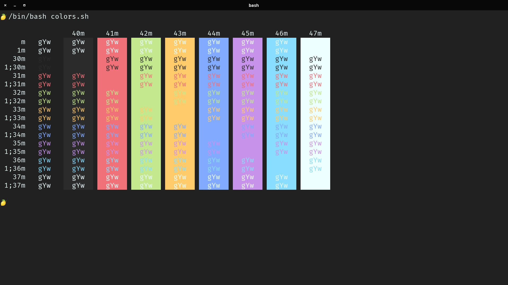
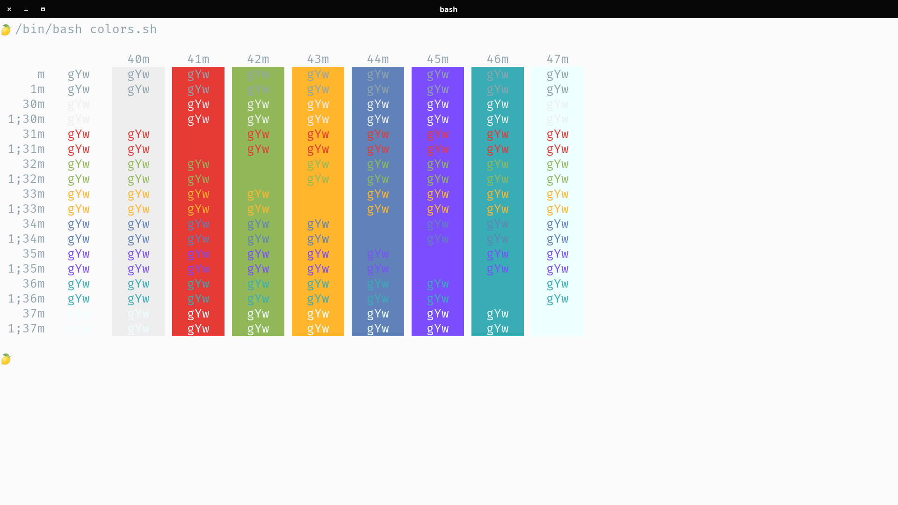
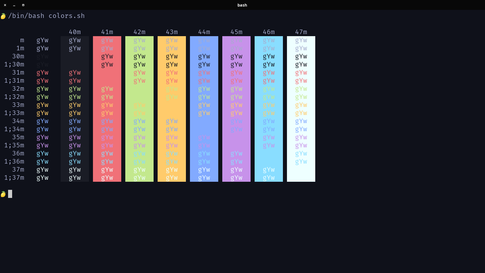
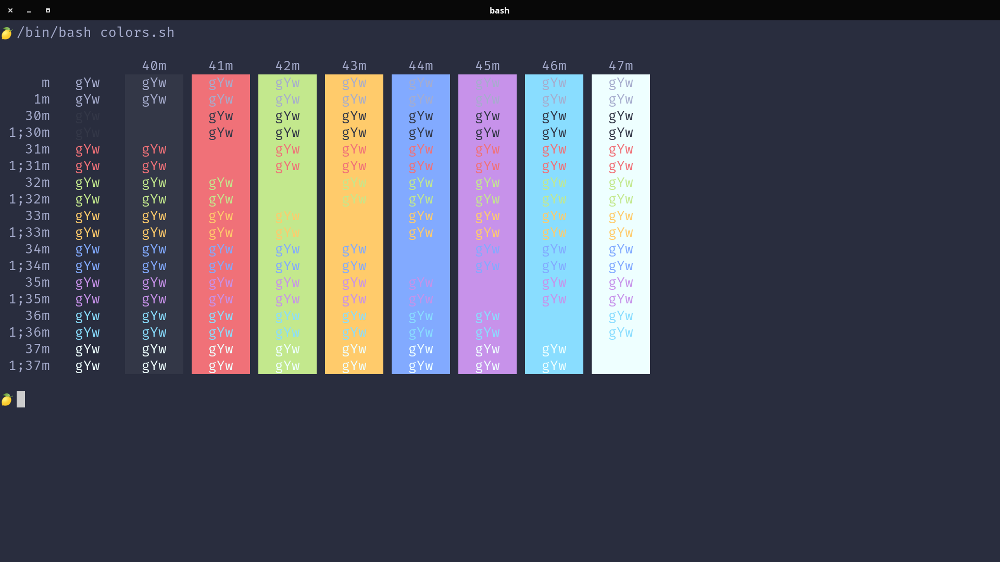

## Material Theme for [Kitty terminal](https://github.com/kovidgoyal/kitty)

### Setup instructions
Copy one color scheme file to `~/.config/kitty/material.vim/` dir.
Include it within your `~/.config/kitty/kitty.conf`. E.g:
```
include ~/.config/kitty/material.vim/terminal-colors/kitty/Material Ocean.conf
```

Optionally, copy the color scheme content directly into the Kitty config.

### Screenshots





