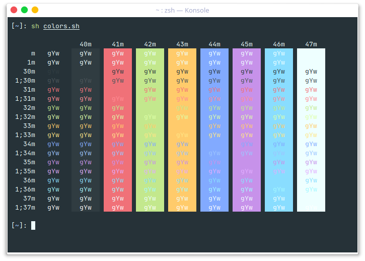
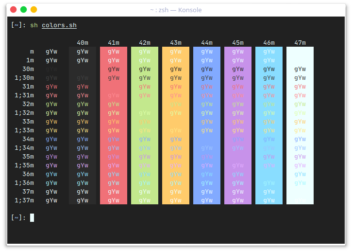
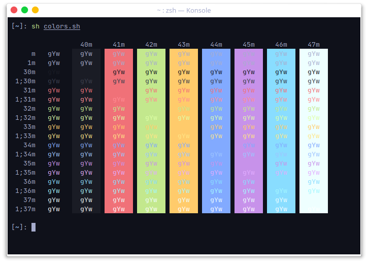
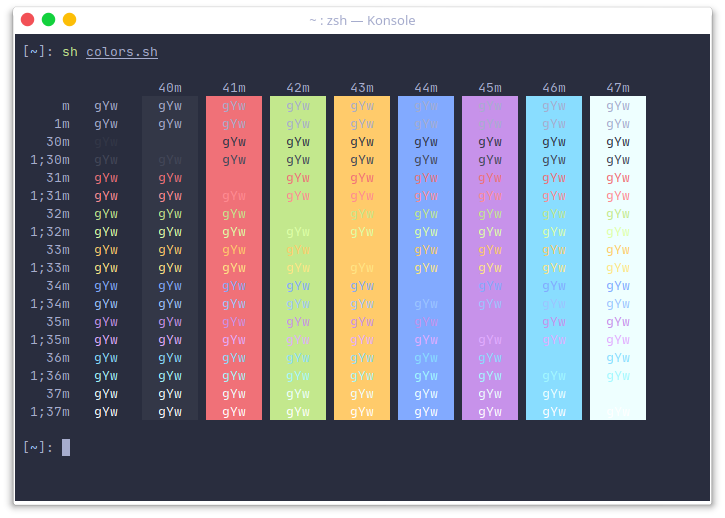

## Material Theme for konsole

Copy colorscheme files to `~/.local/share/konsole/` and restart konsole

### Screenshots

<h4 align=center>
   
  Default  
   
  Darker  
   
  Lighter  
   
  Ocean  
   
  Palenight  
</h4>
